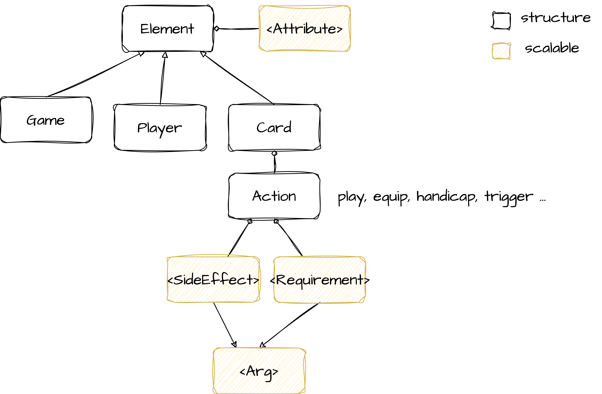

# A Domain Specific Language For Trading Card Games

**Game**: a form of competitive activity played according to rules.

**Trading card games**: it is turn based, cards have actions, cards have properties and cards have rules.
Currently, there is no good way to prototype trading card games and then be able to test the workings and the implications of rules in these games. 

**DSL**: Domain Specific Languages are computer languages designed for a specific domain. 
Since DSLs result in programs that are smaller and easier to understand, they allow even non-programmers to read, write and understand the language.

### Key Features
- [x] Serializable game object
- [x] Equatable game object
- [x] Self-contained logic game object

### MetaModel

- **Game**: Global metaclass which contains all elements in a game.
- **Player**: Players who are participating in a game.
- **Rule**: Rules define the constraints of a game. Rules are either game-wide, or specific to one card.
- **Card**: Cards that are used in a game. Cards can have a cost, can have multiple properties, define additional rules, have actions that can be played and have side effects that happen when they are being played.
- **Action**: Cards can have actions on them. For example an ability of a card that can be activated.

